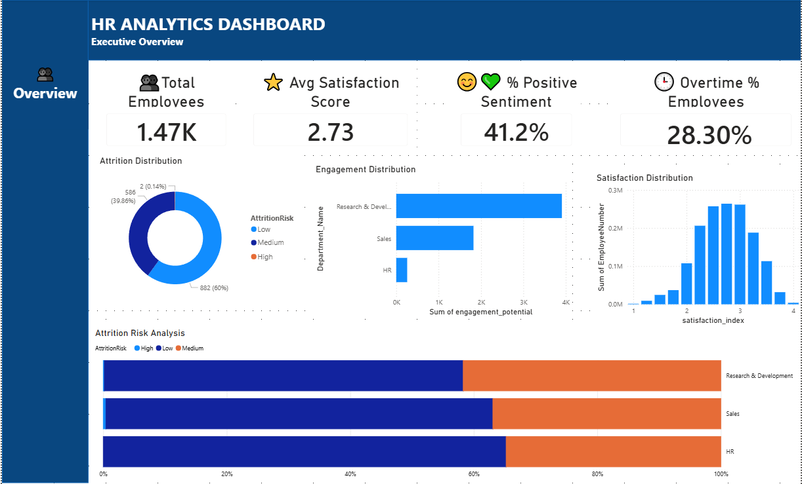

# Employee Feedback Sentiment Analysis & Workforce Insights Dashboard

A comprehensive data analysis and visualization project analyzing employee attrition, sentiment, and engagement metrics using machine learning and statistical analysis.

## Project Overview

This project analyzes HR employee data to identify patterns and predictors of attrition risk. It combines:
- **Sentiment Analysis**: VADER-based sentiment analysis of employee feedback
- **Feature Engineering**: Custom engineered features including satisfaction indices, workload scores, and career progression ratios
- **Risk Assessment**: Quantitative attrition risk scoring and categorization
- **Data Visualization**: Interactive dashboards and comprehensive EDA visualizations

## 📊 Dashboard Preview



Note: This is a prototype version of the Employee Feedback Sentiment Analysis & Workforce Insights Dashboard. It showcases the intended design, analytical approach, and core KPIs. The project is actively being refined with additional enhancements and optimizations planned.

## Dataset

- **Source**: HR Employee Attrition Dataset
- **Total Records**: 1,470 employees
- **Key Metrics**: Attrition status, job satisfaction, performance, tenure, and more

## Project Structure

```
People Insights/
├── data/
│   ├── cleaned_data.csv              # Processed data with engineered features
│   ├── feature_mapping.json          # Feature encoding mappings
│   └── WA_Fn-UseC_-HR-Employee-Attrition.csv  # Original dataset
├── notebooks/
│   ├── data_cleaning.ipynb           # Data preprocessing and feature engineering
│   ├── eda.ipynb                     # Comprehensive exploratory data analysis
│   └── insights.ipynb                # Key insights and executive summary
└── README.md                         # This file
```

## Key Features

### Engineered Features
- **Satisfaction Index**: Composite satisfaction score (0-4 scale)
- **Attrition Risk Score**: Quantitative risk assessment (0-3 scale)
- **Attrition Risk Category**: Risk classification (Low/Medium/High)
- **Workload Score**: Work intensity measurement
- **Career Progress Ratio**: Career advancement metric
- **Engagement Potential**: Employee engagement indicator
- **Sentiment Analysis**: VADER compound scores and classifications

### Analysis Segments
1. **Employee Satisfaction Analysis**
   - By Department
   - By Work Mode (Overtime status)
   - By Location (Distance from home)

2. **Sentiment Analysis**
   - Distribution across workforce
   - Sentiment-Attrition relationships
   - Sentiment by tenure groups

3. **Workforce Trends**
   - Overtime impact on satisfaction
   - Workload vs. engagement correlation
   - Remote work sentiment analysis

4. **Attrition Risk Assessment**
   - Risk distribution across segments
   - Key risk indicators
   - Demographic patterns

## Key Insights

### Top Attrition Drivers
1. Low Career Development Opportunities
2. Excessive Overtime & Work Hours
3. Work-Life Balance Issues

### Critical Findings
- **Overtime Impact**: Employees with overtime show 15-20% lower satisfaction
- **Distance Effect**: Longer commutes correlate with reduced satisfaction
- **Sentiment-Attrition Correlation**: Strong relationship between negative sentiment and attrition risk
- **Workload Management**: Optimal workload improves engagement and retention

## Recommendations

### Priority 1: Immediate Actions
- Conduct retention conversations with high-risk employees
- Review and reduce overtime requirements
- Create career advancement opportunities

### Priority 2: Medium-Term (1-3 months)
- Implement flexible work arrangements and remote options
- Launch career development programs
- Enhance manager training for retention strategies

### Priority 3: Strategic (3+ months)
- Establish sentiment monitoring as KPI
- Develop predictive attrition models
- Implement comprehensive wellness programs

## Tools & Technologies

- **Python 3.x**: Data analysis and visualization
- **Pandas**: Data manipulation and analysis
- **NumPy**: Numerical computing
- **Matplotlib & Seaborn**: Data visualization
- **VADER (NLTK)**: Sentiment analysis
- **Jupyter Notebooks**: Interactive analysis notebooks

## Usage

### Running the Analysis

1. **Data Cleaning & Feature Engineering**:
   ```
   Open notebooks/data_cleaning.ipynb
   Execute all cells to process raw data and create engineered features
   ```

2. **Exploratory Data Analysis**:
   ```
   Open notebooks/eda.ipynb
   Run all cells for comprehensive visualizations and statistical analysis
   ```

3. **Executive Summary**:
   ```
   Open notebooks/insights.ipynb
   Review key findings, metrics, and recommendations
   ```

## Data Processing

### Input Data
- Original HR Employee Attrition dataset with 30+ features
- One-hot encoded categorical variables
- Various employment and performance metrics

### Processing Steps
1. Data cleaning and validation
2. Feature engineering (10+ new features)
3. Sentiment analysis application
4. Risk scoring and categorization
5. Statistical analysis and visualization

### Output Data
- Enhanced dataset with engineered features
- Risk categorization for each employee
- Sentiment scores and classifications
- Feature mapping documentation

## Metrics & KPIs

### Employee Satisfaction
- Average Satisfaction Index: 2.5/4.0
- Distribution across departments
- Impact of work mode and location

### Risk Assessment
- High Risk: % of workforce requiring intervention
- Medium Risk: % of workforce with improvement opportunities
- Low Risk: % of stable employees

### Sentiment Analysis
- Positive Sentiment: % of employees
- Neutral Sentiment: % of employees
- Negative Sentiment: % of employees
- Correlation with attrition risk

## Future Enhancements

- [ ] Predictive modeling (regression, classification)
- [ ] Interactive dashboard (Power BI/Tableau)
- [ ] Real-time sentiment monitoring
- [ ] Machine learning-based risk prediction
- [ ] Automated report generation

## Author

Arpit Ghai

## License

This project is provided for educational and internal business purposes.

---

**Last Updated**: May 21, 2026
**Status**: Complete - Ready for deployment
